# Quantitative-Finance-projects
Welcome to my collection of Quantitative Finance projects. This repository is a curated set of hands-on Python-based projects that demonstrate my understanding and implementation of core financial theories, portfolio analysis, and data-driven investment strategies.

## Overview of the Projects
### P1: 1_Daily_Returns_calculation

  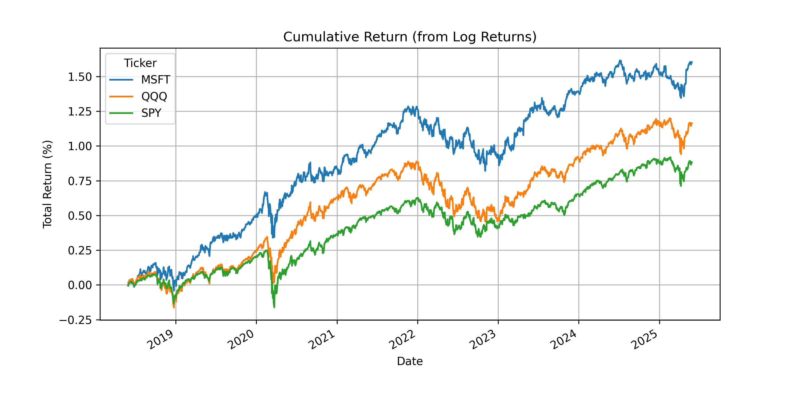
  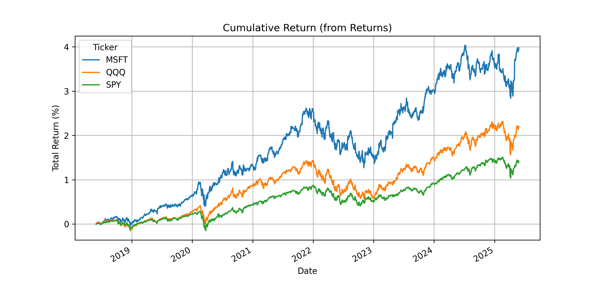

### P2: 2_Calculation_of_beta

  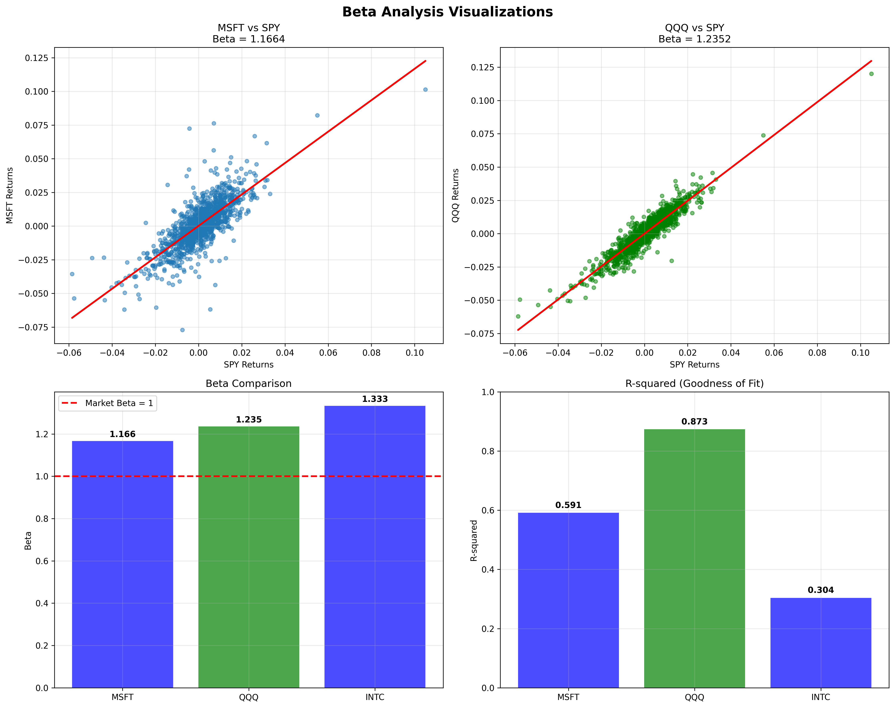

  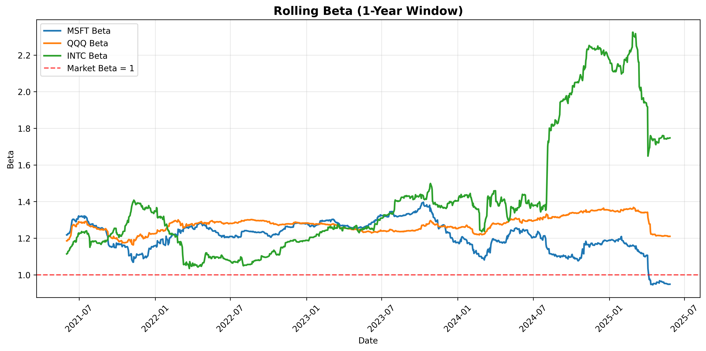

### P4: 4_Investment_performance

  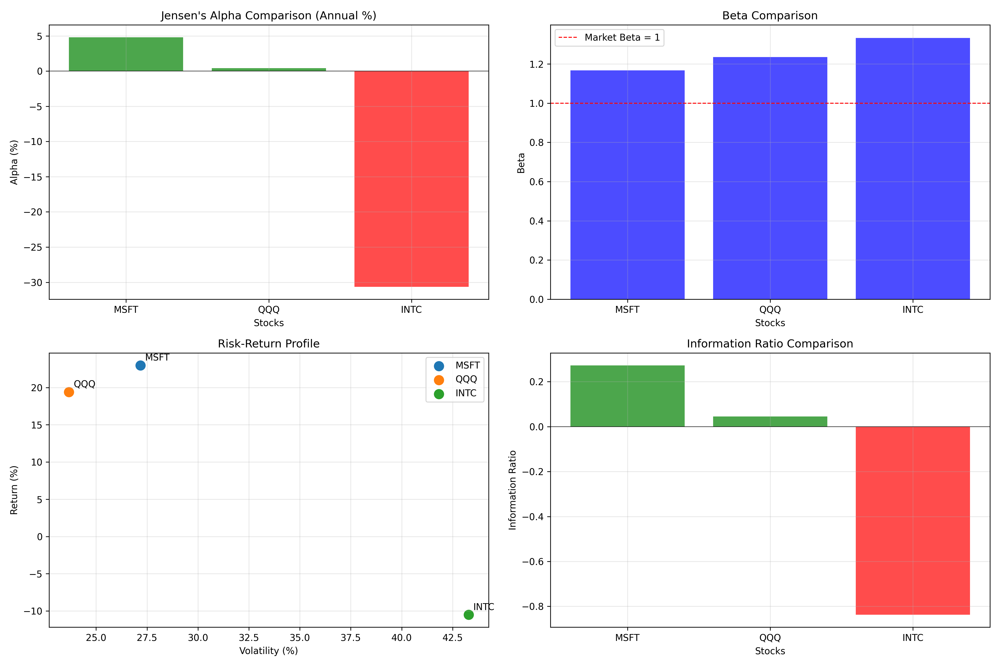

### P5: 5_Efficient_Frontier_and_capital_allocation

  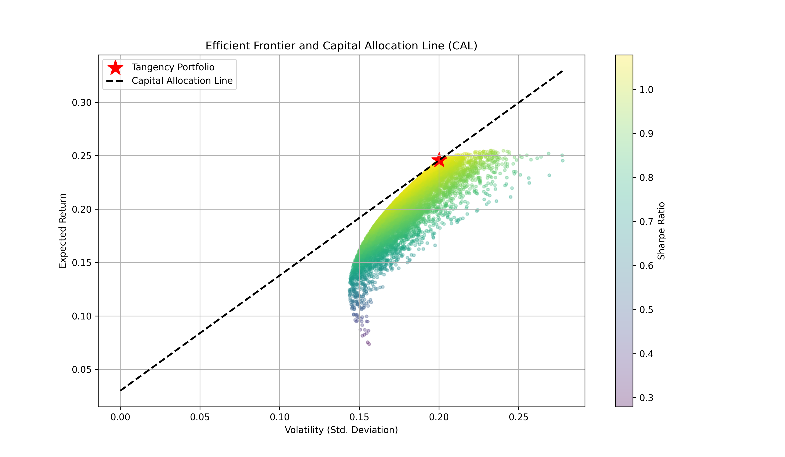

### P6: 6_Optimal_Portfolio

  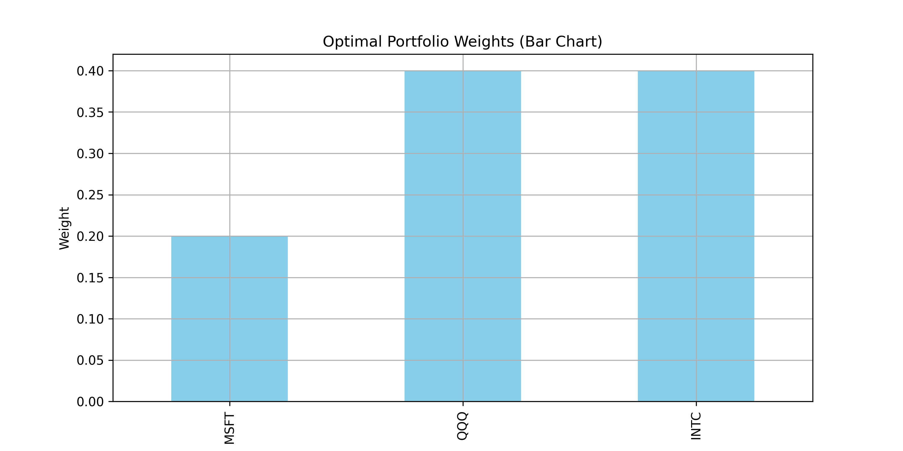
  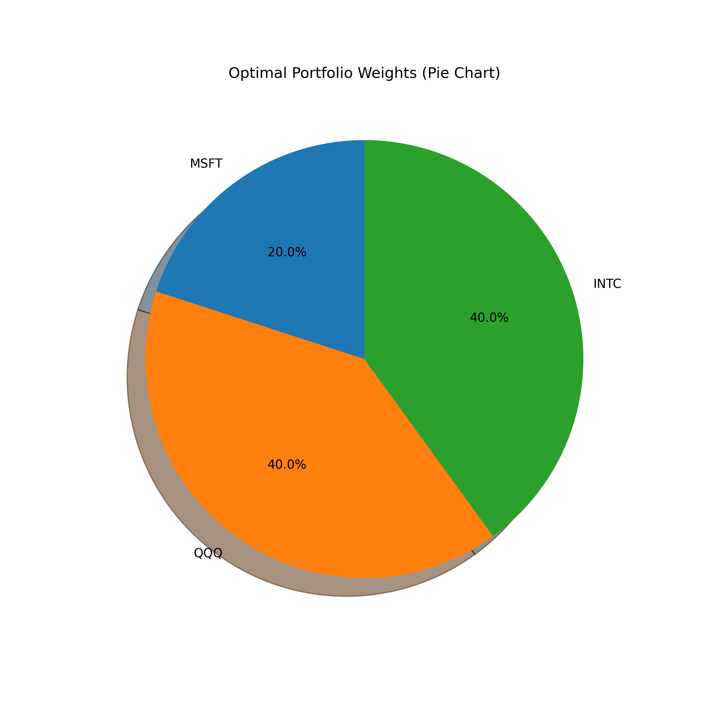

### P7: 7_Monte_Carlo_simulation

  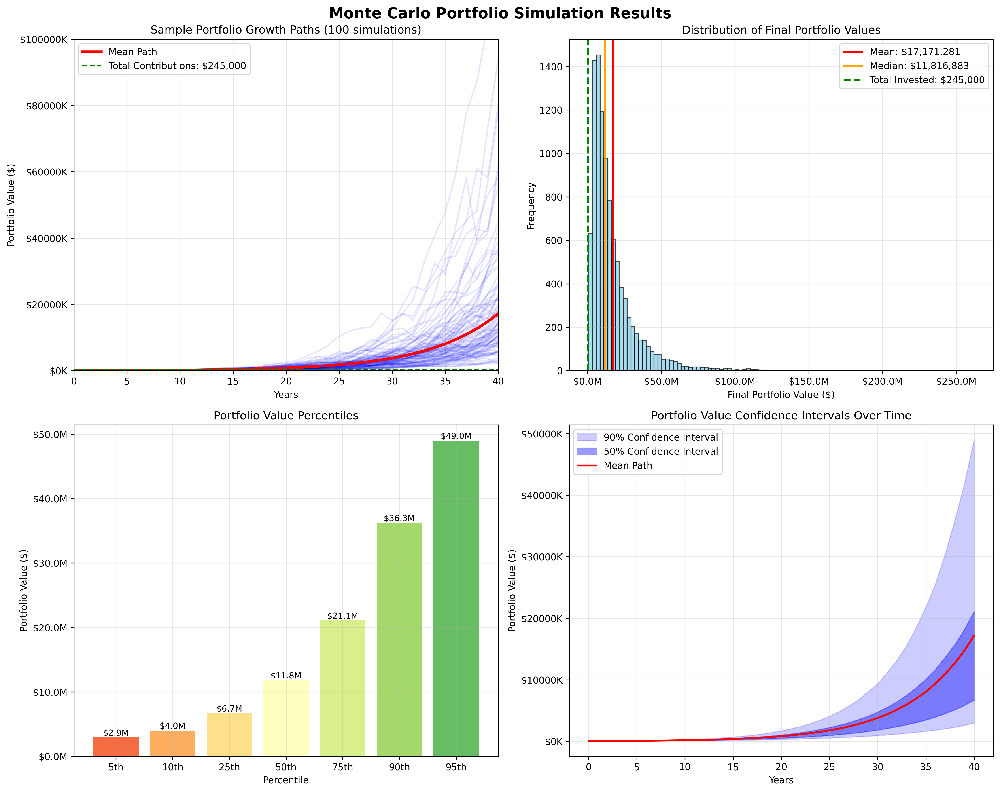

### P8: 8_VaR_MonteCarlo

  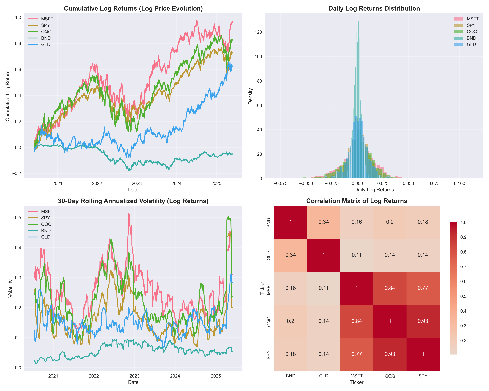

  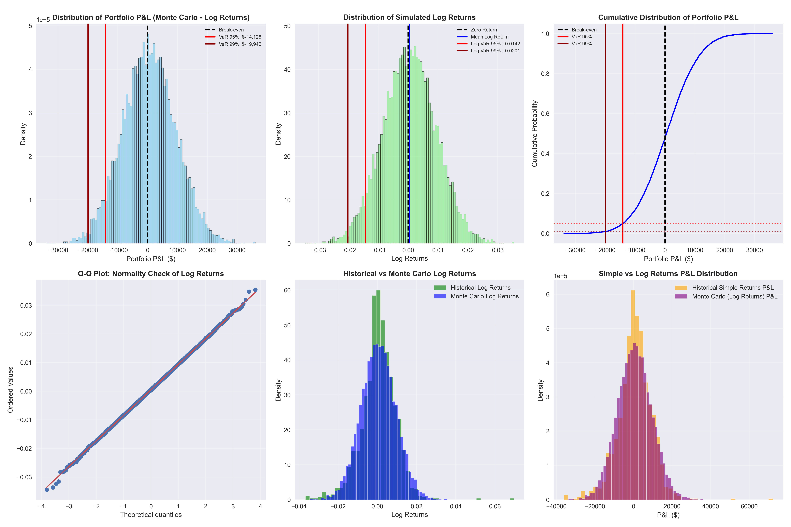

