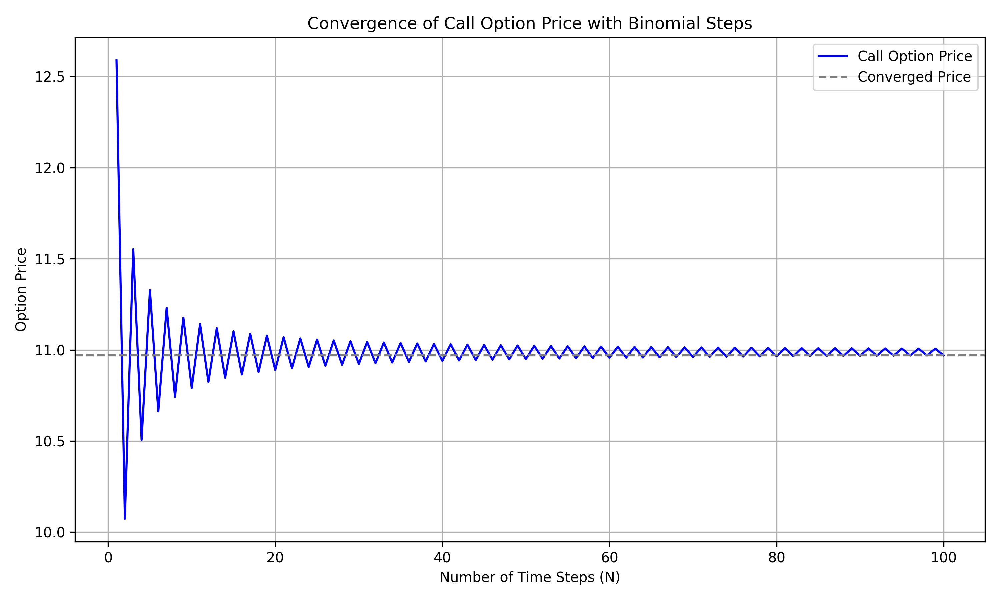

# Quantitative-Finance-projects
Welcome to my collection of Quantitative Finance projects. This repository is a curated set of hands-on Python-based projects that demonstrate my understanding and implementation of core financial theories, portfolio analysis, and data-driven investment strategies.

### P1: 1_Daily_Returns_calculation

### P4: 4_Investment_performance

  

### P5: 5_Efficient_Frontier_and_capital_allocation

  

### P6: 6_Optimal_Portfolio

  
  

### P7: 7_Monte_Carlo_simulation

  

### P8: 8_VaR_MonteCarlo

  

  

### P9: 9_VaR_Historical

  

  

### P11: 11_Binomial_option_pricing

  

### P12: 12_Black_Scholes_option_pricing

  

### P13: 13_Monte_carlo_option_pricing

  

### P15: 15_Time_series_analysis

  

### P16: 16_Project1_M_Joshi

  

### P17: 17_Project2_M_Joshi

  

### P18: 18_Project3_M_Joshi

  

